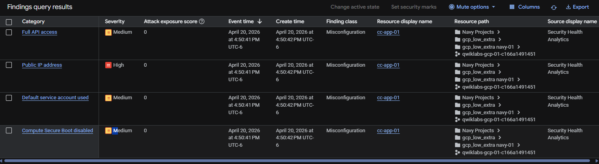
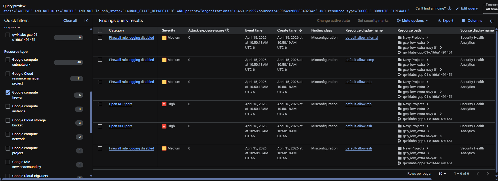
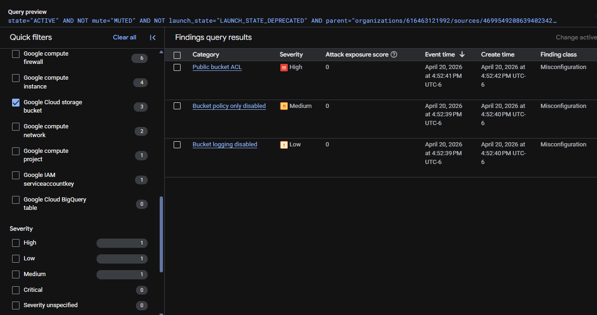
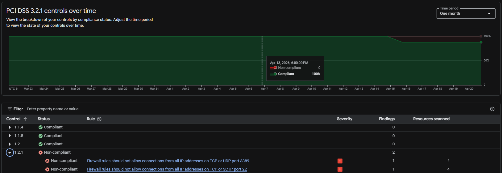
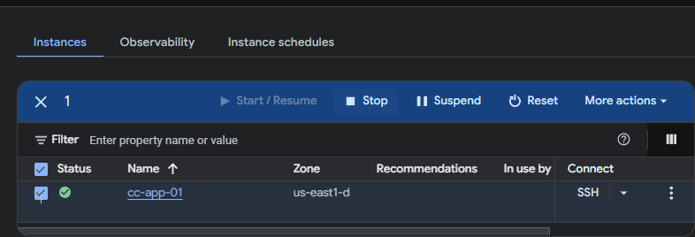
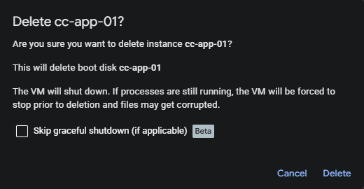

# Cloud Incident Response & Recovery: Cymbal Retail Case


> Acting as a **Junior Cloud Security Analyst**, I led the full incident response lifecycle for a simulated data breach at **Cymbal Retail** — from vulnerability identification through containment, hardening, and compliance validation.

---

## Table of Contents

1. [Introduction & Scenario](#1-introduction--scenario)
2. [Incident Timeline](#2-incident-timeline)
3. [Analysis Phase — Identification](#3-analysis-phase-identification)
4. [Remediation Phase — Containment & Recovery](#4-remediation-phase-containment--recovery)
5. [Network Security & Firewall Hardening](#5-network-security--firewall-hardening)
6. [Compliance Verification](#6-compliance-verification)
7. [Key Takeaways](#7-key-takeaways)
8. [Tools & Technologies](#8-tools--technologies)
9. [Repository Structure](#9-repository-structure)

---

## 1. Introduction & Scenario

**Cymbal Retail**, a global retail organization, experienced a major **Data Breach** that compromised sensitive customer data — including personal and credit card information.

**Mission:** Lead the incident response lifecycle by identifying vulnerabilities, containing threats, restoring compromised systems, and ensuring regulatory compliance under the **PCI DSS 3.2.1** framework.

**Role:** Junior Cloud Security Analyst

---

## 2. Incident Timeline

| Phase | Action | Tool Used |
|-------|--------|-----------|
| T+0 | Breach detected — abnormal data access patterns flagged | Security Command Center |
| T+1h | Vulnerability assessment initiated across GCP environment | SCC + gcloud CLI |
| T+2h | Publicly exposed VM instances and open management ports identified | Security Command Center |
| T+3h | Compromised VM (`cc-app-01`) stopped and isolated | Compute Engine |
| T+4h | Public bucket ACLs revoked — data exfiltration vector closed | Cloud Storage IAM |
| T+5h | Compromised VM deleted — malware source eradicated | Compute Engine |
| T+5h | New VM (`cc-app-02`) deployed from clean pre-infection snapshot | Compute Engine |
| T+6h | Firewall rules hardened — IAP-only SSH access enforced | VPC Firewall |
| T+7h | PCI DSS 3.2.1 re-audit executed — all critical findings resolved | Security Command Center |

---

## 3. Analysis Phase — Identification

I performed a comprehensive **Vulnerability Assessment** using **Security Command Center (SCC)** and prioritized findings by severity to understand the full scope of the breach.

### Critical Findings

**Publicly Exposed VM Instances**
VM instances were assigned public IP addresses, making them directly reachable from the internet with no network-level restriction.

> 

**Open Management Ports (0.0.0.0/0)**
Firewall rules allowed unrestricted SSH (port 22) and RDP (port 3389) access from any IP address — a direct violation of the Principle of Least Privilege.

> 

**Exposed Cloud Storage Bucket**
A storage bucket was configured with a Public ACL, exposing sensitive files including `myfile.csv` to anonymous internet access.

> 

**PCI DSS Baseline — High-Severity Violations**
The initial PCI DSS 3.2.1 report confirmed high-severity findings related to overly permissive firewall rules.

> 

---

## 4. Remediation Phase — Containment & Recovery

### A. Compute Engine Recovery

**Isolation & Eradication**
The compromised VM (`cc-app-01`) was immediately stopped to prevent further lateral movement, then deleted to fully eradicate the malware source.

> 
> 

**Secure Restoration**
A new instance (`cc-app-02`) was deployed from a verified, pre-infection **Snapshot**, ensuring a clean baseline without the risk of residual compromise.

**Shielded VM**
Enabled **Secure Boot** on the restored instance to protect against boot-level malware and unauthorized rootkits going forward.

### B. Cloud Storage Protection

**Access Revocation**
Removed all public ACLs and disabled anonymous access across all storage buckets.

**Uniform Bucket-Level Access**
Migrated to **Uniform Bucket-Level Access** to ensure that only IAM policies govern resource permissions — eliminating ACL-based permission gaps.

---

## 5. Network Security & Firewall Hardening

I significantly reduced the **attack surface** by applying the **Principle of Least Privilege** to the VPC network configuration.

**Legacy Rule Cleanup**
Deleted all permissive "allow-all" rules for ICMP, RDP, and SSH that had no business justification.

**IAP Secure Tunneling**
Created a restricted firewall rule (`limit-ports`) allowing SSH traffic **exclusively** from Google's **Identity-Aware Proxy** IP range (`35.235.240.0/20`). This eliminates direct internet exposure while preserving secure administrative access.

**Firewall Rule Logging**
Enabled logging on all firewall rules to provide full auditability and enable detection of future unauthorized connection attempts.

---

## 6. Compliance Verification

After completing all remediation actions, I re-executed the **PCI DSS 3.2.1** compliance audit in Security Command Center.

The follow-up report confirmed that all high-severity findings related to the breach were resolved. This provides objective, audit-trail-backed evidence that the implemented security controls are effective — not just self-assessed.

---

## 7. Key Takeaways

**Defense in Depth**
No single control was sufficient. Layering IAP tunneling + Shielded VMs + Uniform IAM policies created overlapping protection that would stop multiple attack vectors independently.

**PoLP in Practice**
Replacing `0.0.0.0/0` firewall rules with IAP-only SSH access eliminated the most significant attack surface vector with a single, targeted change.

**Recovery Over Repair**
Deleting the compromised VM and restoring from a clean snapshot is both faster and safer than attempting to remediate an infected instance. In a real incident, trusting a potentially compromised OS is an unacceptable risk.

**Compliance as Validation**
Re-running the PCI DSS 3.2.1 audit after remediation served as objective proof of effectiveness — converting a self-assessed fix into a verifiable, documented result.

**IAP as a Zero-Trust Control**
Using Identity-Aware Proxy for administrative access removes the need for bastion hosts or VPNs, while enforcing identity-based access at the infrastructure level.

---

## 8. Tools & Technologies

| Category | Tools |
|----------|-------|
| **Platform** | Google Cloud Platform (GCP) |
| **Security & Compliance** | Security Command Center (SCC), PCI DSS 3.2.1 |
| **Access Control** | Identity-Aware Proxy (IAP), Cloud IAM |
| **Infrastructure** | Compute Engine (Shielded VMs, Snapshots), Cloud Storage |
| **Networking** | VPC Firewall Rules, Firewall Rule Logging |
| **Automation** | gcloud CLI, Bash Scripting |

---

## 9. Repository Structure

```
cloud-incident-response/
├── README.md
└── evidence/
    ├── instance-vulnerabilities.png
    ├── firewall-vulnerabilities.png
    ├── storage-vulnerabilities.png
    ├── pci-dss-baseline.png
    ├── containment-stop-vm.png
    └── eradication-delete-vm.png
```

---

> 📜 This project is part of the [Google Cloud Cybersecurity Professional Certificate](https://www.cloudskillsboost.google/).
