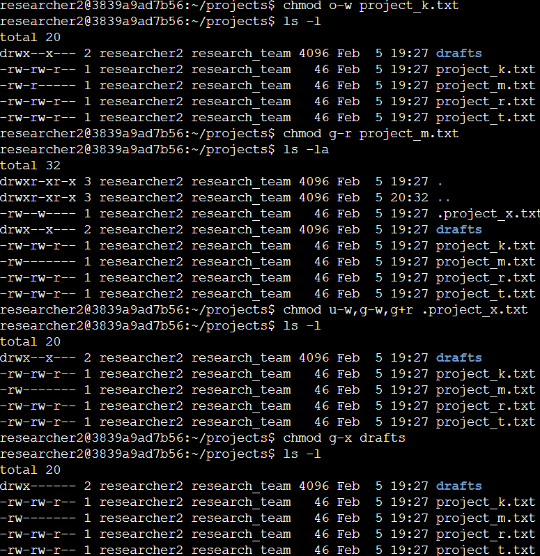

# Linux File Permissions & Access Control Audit

## Project Description
As a security professional, my primary responsibility is to audit and manage access to critical digital assets. In this lab, the research team handled sensitive data that required strict control to prevent information leaks or accidental modifications. The permissions did not initially reflect the required authorization levels.

My goal was to update permissions in the `projects` directory to enforce the **Principle of Least Privilege (PoLP)**, ensuring that each entity (user, group, and others) has only the minimum level of access required to perform its function.

---

## Phase 1: Security Audit (Reconnaissance)
The first step in any security audit is reconnaissance. I used the Command Line Interface (CLI) to identify the current working directory and list all its contents.


- **Command used**: `ls -la`
- **Technical Detail**: The `-la` flag lists all directory contents, including hidden files (those starting with a dot), and displays detailed metadata such as permissions, ownership, and timestamps.
- **Observation**: The initial audit revealed one directory named `drafts`, one hidden file named `.project_x.txt`, and five additional project files with overly permissive settings that required hardening.

---

## Phase 2: Technical Knowledge (POSIX Standard)
In Linux, file permissions are represented by a 10-character string in the first column of the `ls -l` output.

### Permission String Breakdown
- **1st character**: Indicates the file type (`d` for directory, `-` for regular file)
- **2nd–4th characters**: Read (r), write (w), execute (x) permissions for the **User/Owner**
- **5th–7th characters**: Permissions for the **Group**
- **8th–10th characters**: Permissions for **Others**

### Numeric (Octal) Notation
In SOC and enterprise environments, **Octal Notation** is commonly used for automation and precision.

- **Read (r)** = 4  
- **Write (w)** = 2  
- **Execute (x)** = 1  

| Symbolic | Calculation | Octal | Access Level |
|--------|-------------|-------|--------------|
| rwx | 4+2+1 | 7 | Full Access |
| rw- | 4+2+0 | 6 | Read & Write |
| r-x | 4+0+1 | 5 | Read & Execute |
| r-- | 4+0+0 | 4 | Read Only |
| --- | 0+0+0 | 0 | No Access |

---

## Phase 3: Hardening Tasks (Task Execution)
Following organizational security policies, I executed several `chmod` commands to restrict unauthorized access.



### 1. Restricting "Others" on project_k.txt
* **Command**:
  ```bash
  chmod o-w project_k.txt

Logic: I used the chmod command to remove the write privilege (-w) from the Others (o) category. This action prevents unauthorized modification by external users, ensuring the integrity of the research data.

2. Securing Hidden File .project_x.txt
Command:

Bash
chmod u-w,g-w,g+r .project_x.txt

Logic: I used a combined syntax to improve efficiency. I removed write permissions for both the User (u-w) and the Group (g-w) to prevent accidental changes. Simultaneously, I explicitly added read permissions to the Group (g+r) so researchers can still consult the file.

3. Directory Hardening (drafts)
Command:

Bash
chmod g-x drafts

Logic: I removed the execute permission (-x) from the Group (g). In Linux directories, the execute bit controls the ability to enter or traverse the folder. By removing it, only the owner can access the drafts.

Phase 4: Final Verification
After applying the changes, I performed a final check using ls -la to ensure the Security Posture was correctly updated according to organizational policies.

Verification Results:

Owners (User): Retain necessary control and access while avoiding accidental changes to archived or sensitive files.


Groups: Have strictly limited access, restricted only to the resources required for their specific tasks.


Others: Are prevented from reading, modifying, or executing sensitive research files, significantly reducing the Attack Surface.

Summary
Through this audit and intervention, I successfully aligned the filesystem privileges with the organization's security goals. By establishing a robust Access Control framework, we protect the Confidentiality and Integrity of critical assets in the Linux environment.


Verification Results
Owners retain necessary control without risking accidental changes.

Groups have strictly limited access to required resources.

Others are prevented from modifying sensitive research files, reducing the attack surface.
