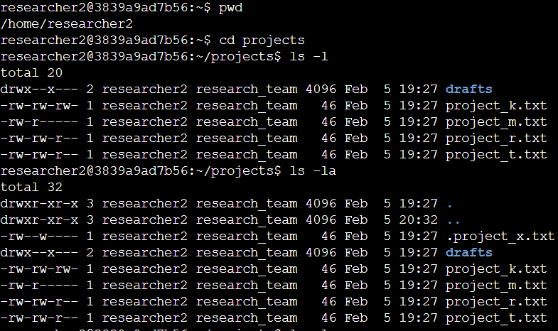
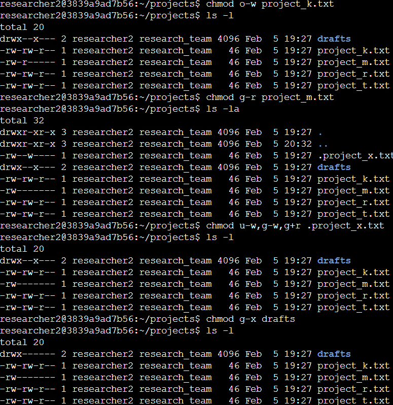
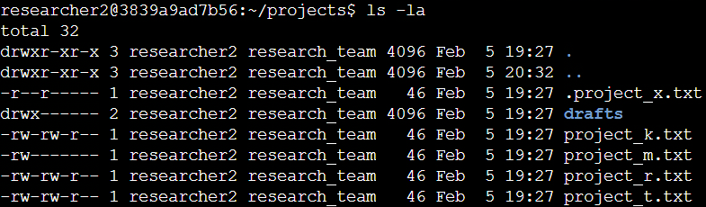

# Security Audit Report: Linux Filesystem Access Control & Privilege Hardening

**Tagline:** Tactical implementation of the Principle of Least Privilege (PoLP) to mitigate the risk of unauthorized data modification and privilege escalation in Linux environments.

---

## 1. Audit Metadata

| Attribute | Detail |
| :--- | :--- |
| **Auditor / Author** | Edgar Yair Rosas Flores |
| **Simulated Role** | Security Analyst / Auditor |
| **Target System** | Linux Server (`projects` directory) |
| **Status** | Completed - Remediated |
| **Reference Frameworks** | CIS Controls (Control 3: Data Protection), NIST CSF (PR.AC-4) |

---

## 2. Executive Summary

During a routine security posture assessment of a research storage server, overly permissive access configurations were identified within the `projects` directory. Sensitive and hidden files presented vulnerabilities in their POSIX permissions matrix, exposing the organization to potential Data Leaks or Data Tampering (both accidental and malicious). 

This report documents the technical audit and remediation process to enforce a strict access control framework, aligning the system with the **Principle of Least Privilege (PoLP)** and ensuring the Confidentiality and Integrity of digital assets.

---

## 3. Threat Modeling & Technical Analysis

### Attack vs. Remediation Flow (*Misconfiguration Flow*)

```text
INITIAL STATE (Vulnerable)
+-------------------+       +-----------------------+       +-------------------+
|   Threat Actor    |       | Directory/File        |       | Impact:           |
| (Internal/Other)  | ----> | Open Permissions      | ----> | Integrity         |
|                   |       | (e.g., rwxrwxrwx)     |       | Alteration        |
+-------------------+       +-----------------------+       +-------------------+
                                       |
                           [ Technical Intervention ]
                           [     chmod Commands     ]
                                       v
SECURED STATE (Hardened)
+-------------------+       +-----------------------+       +-------------------+
|   Threat Actor    |       | Directory/File        |       | Impact:           |
| (Internal/Other)  | -/->  | Restricted Access     | ====> | Confidentiality   |
|                   |  X    | (e.g., rw-r-----)     |       | & Integrity       |
+-------------------+       +-----------------------+       +-------------------+
```

### MITRE ATT&CK Tactics and Techniques Mapping

* **Tactic:** Discovery (TA0007) / Privilege Escalation (TA0004)
* **Technique:** File and Directory Discovery ([T1083](https://attack.mitre.org/techniques/T1083/))
* **Mitigation:** File and Directory Permissions Modification ([T1222.002](https://attack.mitre.org/techniques/T1222/002/)) - *Use of native OS controls to restrict access.*

---

## 4. Methodology / Approach

The audit was executed in three sequential phases:

1. **Reconnaissance:** Attack surface mapping and permission baseline capture using CLI commands.
2. **Remediation (Hardening):** Application of configuration patches to restrict unauthorized access.
3. **Verification:** Validation of the effectiveness of the implemented security controls.

---

## 5. Technical Execution & Results

### Phase 1: Baseline Auditing

An initial scan of the directory was executed to reveal hidden files and security metadata.

```bash
# Exhaustive enumeration of the projects directory
ls -la
```

**Evidence 1: Initial state capture**



> **Findings:** The audit revealed 5 regular project files, 1 hidden file (`.project_x.txt`), and 1 subdirectory (`drafts`) with configurations that granted read and write access to unauthorized entities.

### Phase 2: Remediation & Privilege Hardening

Based on organizational security policies, permission modification commands were executed.

**Evidence 2: Technical execution of remediation**



#### Action A: Third-Party Write Restriction

* **Target:** `project_k.txt` file
* **Risk Vector:** The "Others" group possessed write permissions.

```bash
# Revocation of the write permission (w) for the Others group (o)
chmod o-w project_k.txt
```

#### Action B: Securing Hidden Assets

* **Target:** `.project_x.txt` hidden file
* **Risk Vector:** Vulnerable to accidental modifications, with read access blocked for the research team.

```bash
# 1. Write block for User (u) and Group (g)
# 2. Explicit read access granted to Group (g)
chmod u-w,g-w,g+r .project_x.txt
```

#### Action C: Directory Traversal Restriction

* **Target:** `drafts` subdirectory
* **Risk Vector:** Execute permission (`x`) was unnecessarily enabled for the Group.

```bash
# Revocation of the execute permission (x) for the Group (g)
chmod g-x drafts
```

### Phase 3: Posture Verification

After applying the changes, a final check was performed to ensure the permissions matrix strictly reflected the desired access control.

**Evidence 3: Validation of applied controls**



> **Result:** The POSIX matrix confirms that excessive privileges were successfully revoked across all analyzed assets.

---

## 6. Security Impact

The technical intervention significantly reduced the Insider Threat Surface:

1. **Integrity Protection:** Research data can no longer be manipulated, altered, or deleted by unauthorized users (the "Others" category).
2. **Human Error Mitigation:** By removing write permissions even for owners on archived/hidden files, accidental data corruption is prevented.
3. **Access Containment:** Blocking directory traversal strictly confines users to the areas required for their daily operations.

---

## 7. Mitigation / Recommendations

To maintain a robust long-term security posture, the following policies are recommended:

* **Automated Audits:** Implement automated scripts (e.g., `find /projects -perm /002`) to trigger alerts for files created with global write permissions.
* **Umask Adjustment:** Configure a more restrictive default `umask` (such as `027` or `077`) at the system level to ensure new files are Secure by Design.
* **Role-Based Access Control (RBAC):** Scale permission management by integrating Access Control Lists (ACLs) for greater granularity in complex teams.

---

## 8. What this demonstrates

* **Linux Security & CLI Mastery:** Advanced and fluent use of the Linux command line for system administration and auditing.
* **Identity & Access Management (IAM):** Deep understanding of the POSIX standard and permission notation (symbolic and octal) to manage authorization for users, groups, and others.
* **Security Policy Enforcement:** Ability to translate abstract security policies (like the Principle of Least Privilege) into executable and verifiable technical configurations.
* **Incident Prevention:** Proactive identification of misconfigurations and application of corrective measures (Hardening) aimed at protecting the CIA triad (Confidentiality, Integrity, and Availability).
